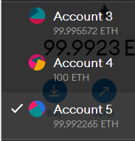
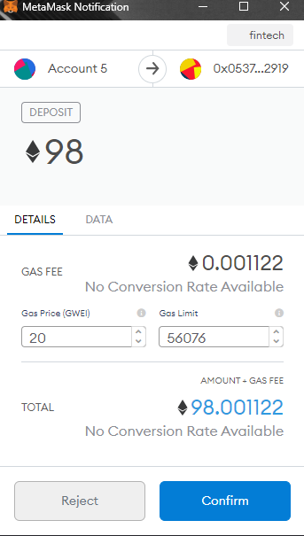
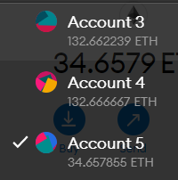
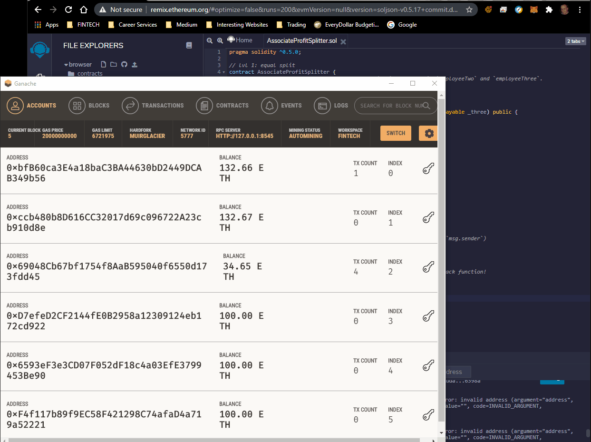

# Contractual Profit Splitting
The following repository is to show the skills and understanding of creating a contract using Solidity from the lectures taught by the Rice University FinTech Bootcamp and 2U.[1]

---

## Table of contents
* [General Information](#general-information)
* [Screenshots](#screenshots)
* [Dependencies](#dependencies)
* [Installation Guide](#installation-guide)
* [Code Examples](#code-examples)
* [Usage](#usage)
* [Sources](#sources)
* [Status](#status)
* [Contributors](#contributors)

---

## General Information

Our company created its own Ethereum-compatible blockchain and wants to use the technology to connect financial institutions while increasing transparency and automating accounting and auditing.  Three profit splitting contracts are listed below.  While only one is required for completion of the the assignment, all three can be completed if there is enough time.

* Pay your Associate-level employees quickly and easily.

* Distribute profits to different tiers of employees.

* Distribute company shares for employees in a "deferred equity incentive plan" automatically.[1]

---

## Screenshots

* Value of accounts before deposit



* Transaction confirmation



* Value of accounts after deposit



---

## Dependencies

* Ganache 2.5.4+
    * Create a workspace configured for ETH and localhost:8545
    * Create three addresses with prefunded balances

* MetaMask 9.0.4+
    * Import the same three addresses created in Ganache
    * Configure the same network as used previously with Ganache

* Remix
    * A [Remix Ethereum](http://remix.ethereum.org) account must be created to run the Solidity contract file

---

## Installation Guide

1. Download the entire repository

2. Make sure the [dependencies](#dependencies) are configured before moving to the next step

3. Open Remix and import the [AssociateProfitSplitter](AssociateProfitSplitter.sol) file

*See the [Usage](#usage) section below for instructions to run the notebook.

---

# Code Examples

* Deposit function

```solidity
function deposit() public payable {
        // split `msg.value` into three
        uint amount = msg.value / 3;

        // Transfer the amount to each employee
        employeeOne.transfer(amount);
        employeeTwo.transfer(amount);
        employeeThree.transfer(amount);

        // take care of a potential remainder by sending back to HR (`msg.sender`)
        msg.sender.transfer( (msg.value - (amount * 3)) );
    }
```

---

## Usage

1. Open Ganache and start your preconfigured workspace

2. Open your web browser and make sure MetaMask is logged in with your Ganache workspace select as the network to use.

3. Open Remix and compile the AssociateProfitSplitter.sol file by selecting the Compile button from the Solidity Compiler option in the left navigation bar.

4. Once compiled, click the Deploy & Run Transaction option in the left navigation bar of Remix (keep in mind, the option might be labeled something different as the site is enhanced over time).

5. Choose "Injected Web3" from the Environment drop down menu and choose "ether" in the Value drop down menu.  (leave the numerical value 0, zero, for deployment).

6. MetaMask will ask for confirmation of the accounts to use and the deployment.  Check the three accounts preconfigured and confirm the configuration.

6. Click the Deploy button in Remix to deploy the contract configuration.

7. Try using the contract by entering the employee addresses, specifying a Value of ether to deposit and dispurse and then clicking the Deposit button futher down the page.

8. You should see the accounts change values and evenly dispurse funds between the three accounts while returning the remainder to "Human Resources"/the original account making the deposit.  Success!!

The following is a short clip of the usage steps mentioned above.  It starts by showing the three accounts used in Ganache and MetaMask.  Enjoy!



---

## Sources

- [1] https://rice.bootcampcontent.com/Rice-Coding-Bootcamp/rice-hou-fin-pt-09-2020-u-c/tree/master/hw/20-Solidity/Instructions

---

## Status

Project is: _Complete_

---

## Contributors

* Jonathan Owens
* LinkedIn: www.linkedin.com/in/jonowens
